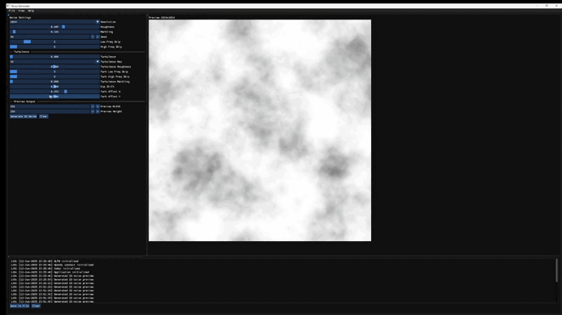

# Noise Generator


An interactive C++ desktop application for generating and visualizing procedural 2D noise (including Perlin noise) with customizable parameters, preview rendering, and export options.

## ✨ Features

- ✅ Procedural 2D noise generation (Perlin + turbulence + marbling)
- ✅ Real-time GUI interface using ImGui with docking support
- ✅ Adjustable parameters: resolution, seed, roughness, marbling, frequency skips
- ✅ Turbulence distortion with exponential shifting and offsets
- ✅ Live preview of generated noise textures
- ✅ Export to `.png` and `.tga` formats
- ✅ Built-in logger (with UI panel and save-to-file functionality)
- ✅ Asynchronous generation with visual progress

---

## 📸 Preview



---
## 🧩 Dependencies

| Library          | Purpose                  |
|------------------|---------------------------|
| [GLFW](https://www.glfw.org/)         | Window & input handling      |
| [GLAD](https://glad.dav1d.de/)        | OpenGL function loader       |
| [Dear ImGui](https://github.com/ocornut/imgui) | GUI rendering                |
| stb_image_write  | PNG & TGA image saving   |
| OpenGL 3.3+       | GPU rendering backend     |
---

## 🛠 Building with CMake
This project uses CMake ≥ 3.11 and automatically fetches its dependencies (GLFW, GLAD, ImGui) via FetchContent. No manual installation required.

🔧 Build Instructions

Windows (Visual Studio):
```
git clone https://github.com/VaeDeveloper/NoiseGenerator.git
cd NoiseGenerator
cmake -B build -G "Visual Studio 17 2022" -A x64
```

Linux
```
git clone https://github.com/VaeDeveloper/NoiseGenerator.git
cd NoiseGenerator
mkdir build && cd build
cmake ..
make
./NoiseGenerator
```

✅ Requirements
CMake ≥ 3.11
C++17 compatible compiler
OpenGL 3.3+ support
Internet connection (for dependency fetching)
